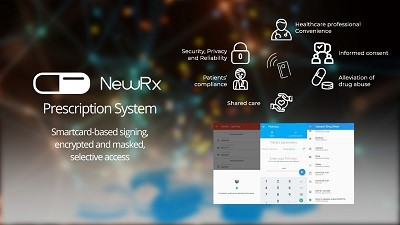

### Misc.
- This is a project archive.
- Project stack: **Flutter, JS**
- Project dated **May 2018**
- This only contains the client app 

# [NewRx](https://2018.ibcol.org/#contestant "NewRx")
- Built with Flutter (beta), JS, on the IOTA with MAM (Masked Authenticated Messaging) decentralised network.
- NewRx is a platform-agnostic protocol for a 21st-century prescription system with smart cards.
- Doctors can sign a medical prescription with a digital signature (implemented with ed25519 for this project), broadcast it to the IOTA mainnet with MAM which ensures privacy, and can be done in a trustless and cross-border way. Pharmacists or other dispensaries can verify the integrity and authenticity of the prescription.

